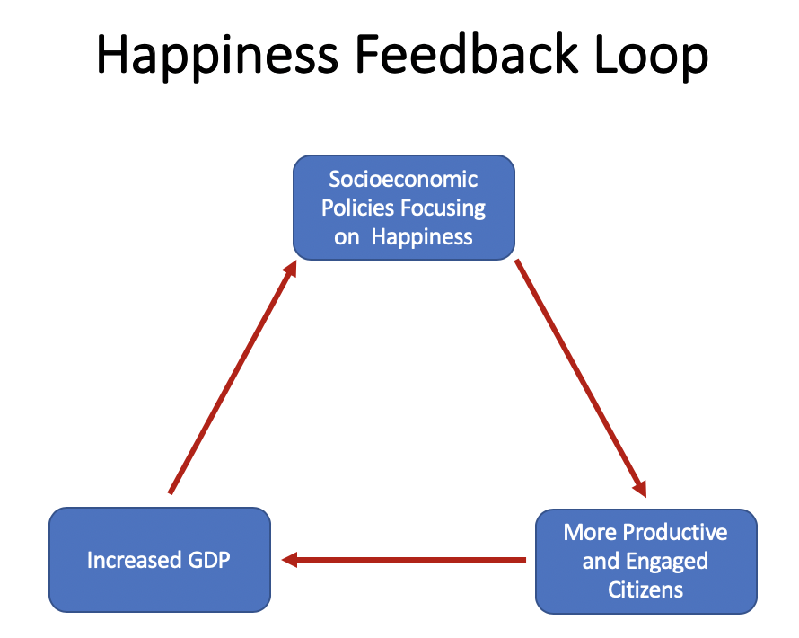
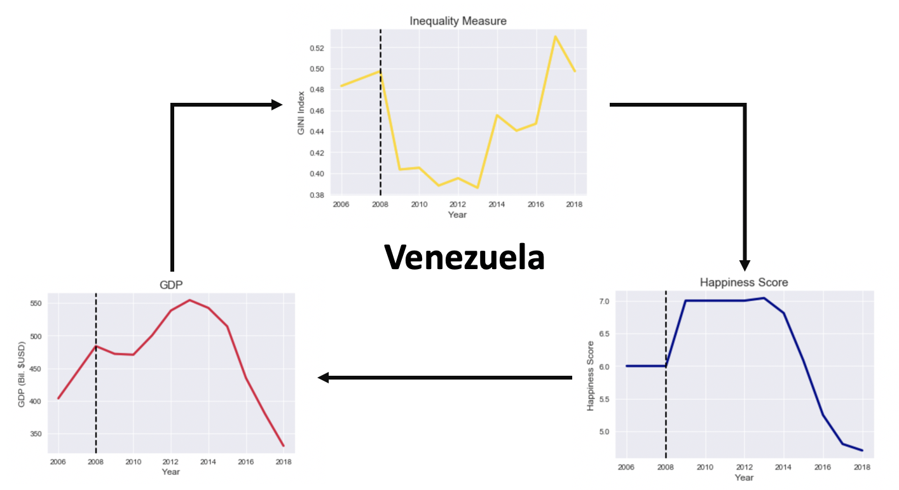
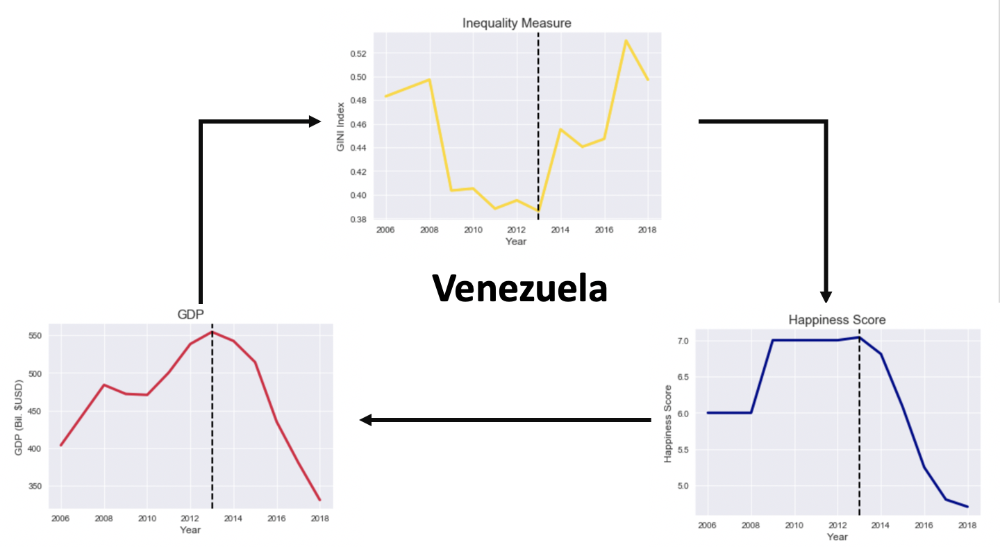
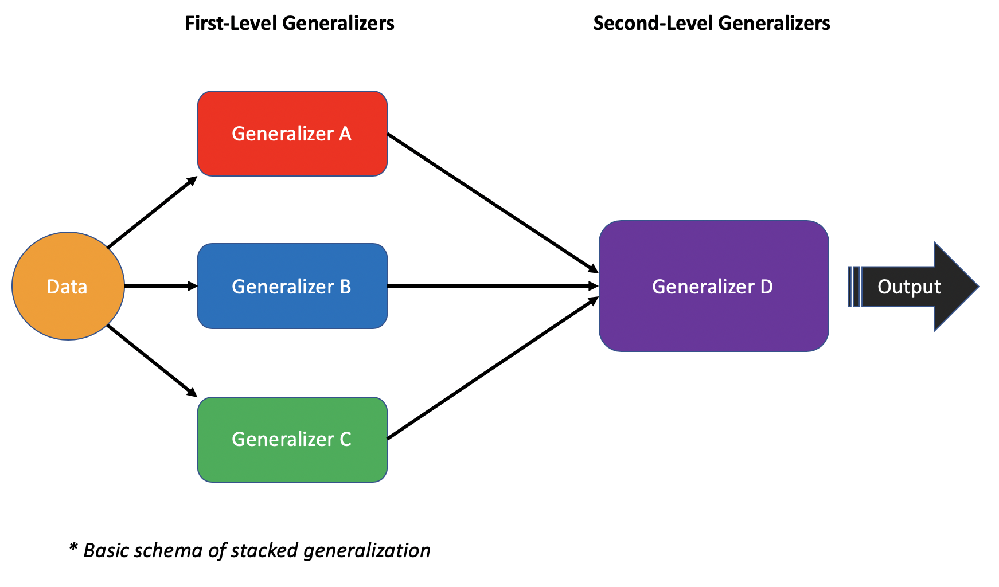
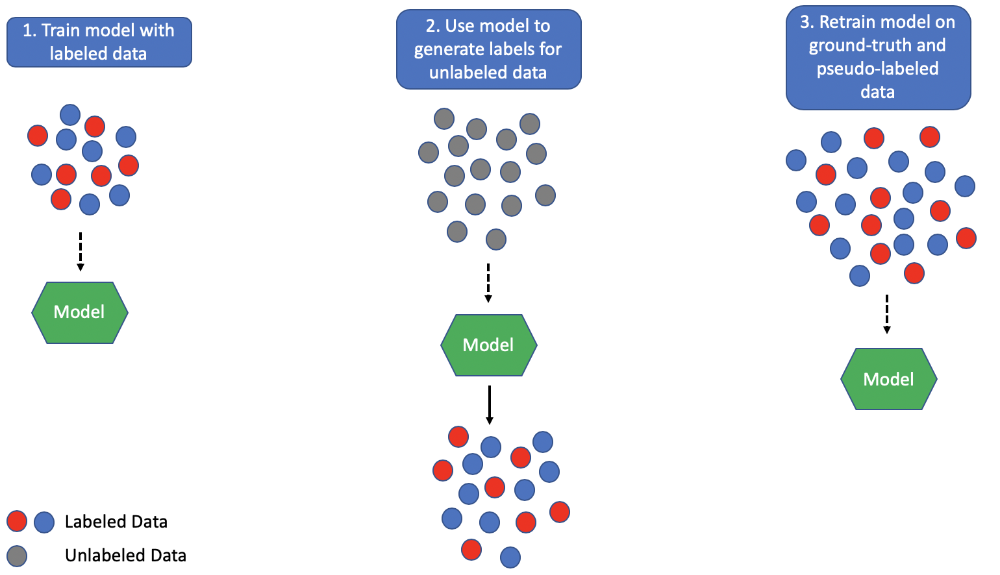
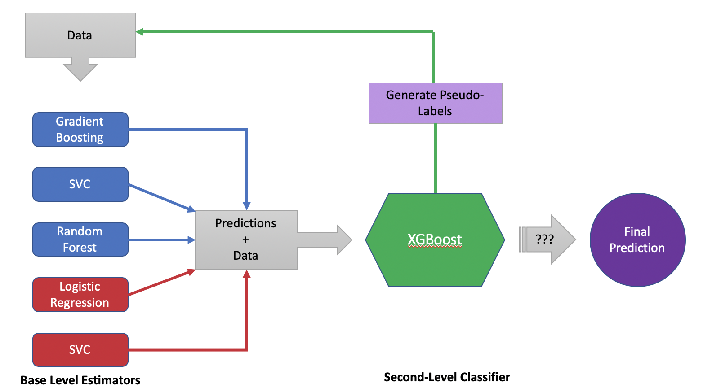
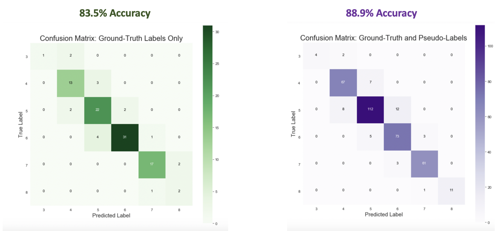

# World Happiness Index

## Happiness Feedback Loop
Since the publication of the Wealth of Nations by Adam Smith in the 1700’s, it has been thought that a nation’s wealth is directly proportional to its citizen's happiness. And for the most part, that is true as 15 of the top 25 happiest countries in 2019 are also in the top 25 countries with the highest GDP. Thus, most current governmental policies are focused on increasing GDP as the main strategy for promoting the happiness of its citizens. However, the [World Happiness Report](https://worldhappiness.report/), an annual publication from the United Nation’s Sustainable Development Solutions Network summarizing global happiness measures, has found that while the world is becoming richer as a whole there is still considerable unhappiness and that many of the most affluent nations are actually declining in happiness. In a sense, we now have data to prove the old saying that money can’t buy happiness.

To combat the socioeconomic burden of declining mental health, the Global Council for Happiness and Well-Being analyzes the findings and data from these reports with the aim of creating a framework for government policy makers to follow that will promote happiness in accordance with 17 sustainable development goals. These goals outline a holistic approach to the development of happiness by focusing on fostering equitable and inclusive economies, quality education, accessible healthcare, social protection, and the preservation of the natural environment. The council has found that not only do the policies of the happiest countries align with a majority of the sustainable development goals, but that the citizens of the happiest countries are also more prosocial, engaged in government, and productive. Essentially, happiness breeds more happiness. Because the Global Happiness Report’s initial publication was in 2012, the long-term effects of adhering to the sustainable development goals is unknown. But, being able to model happiness scores for a  nation will better inform that nation’s policy makers on developing a stable and productive environment for its citizens.

This happiness feedback loop can be illustrated using Venezuela as a specific example to evaluate how happiness scores change in response to public policy as it has seen some dramatic changes in the past 10 years. In the 2015 Global Happiness Report, Venezuela was ranked 22nd with a happiness score of 6.8 (out of 10). Since then it has fallen 85 spots to 107th in the 2019 report and dropped its happiness score by 2.1 points. The dramatic decline of the happiness of this nation’s citizens is a direct result of it current socioeconomic crisis. Venezuela is currently experiencing shortages of basic goods, increased child mortality and disease, rapidly rising unemployment rates, and unprecedented hyperinflation. Understandably, Venezuelans are unhappy, which has led the the mass emigration of 3 million people to the surrounding countries.

These three graphs represent the three points on the happiness feedback loop. The graph at the top of the screen displays the change in Venezuela’s socioeconomic equality ([Gini index](https://www.census.gov/topics/income-poverty/income-inequality/about/metrics/gini-index.html)) from 2006 to 2018. The graph in the bottom right of the screen displays its happiness scores over that same time period and the graph in the bottom left displays its GDP. Beginning with GDP, we can see a sharp increase between 2006-2008. As Venezuela is one of the world’s leading oil exporters, this is most likely in response to the rebound of oil prices in the early 2000’s. This increase in revenue then funded numerous populist social policies that dramatically decreased wealth inequality, as shown by the steep drop in the yellow line in the top graph. This decrease in inequality corresponds with an increase in national happiness as displayed in the bottom right graph. 

Happiness scores remained high until 2013, when a contested election following the death of Hugo Chavez and widespread corruption sent the country on its current downward spiral.  The sharp increase seen in the inequality measure aligns with the drastic decrease in both the nation’s happiness scores and GDP. To frame this in the context of the happiness feedback loop. Rising levels of inequality have lead to an unhappy and unproductive economy, which has in turn resulted in a decrease in GDP and thus fewer available funds to invest in prosocial public policies and projects.

## Model Stacking

The technique of stacked generalization, informally known as model stacking, was first proposed by by David H. Wolpert in 1992. Its basic schema (displayed in the figure above) can be thought of as multiple levels of generalizers, models that each have been trained to describe the characteristics of a population. Essentially, the data is fed into all of the first-level generalizers. These first-level generalizers each make a prediction on the data to produce second-level data composed of the output from each of the first-level generalizers and the data used to produce those outputs. This second-level data is then presented to the second-level generalizer, which produces the final predictions for the dataset. Of course, this schema could also be extended to more than two levels of generalizers if required by the particular problem being solved.

There are two main reasons why stacked generalization improves upon the performance of a single generalizer. First, the composition of the first-level generalizers allows for greater coverage/description of the total population. For example, let’s say our first-level has three generalizers, A, B, and C. Generalizer A describes 70% of the total population, whereas generalizers B and C describe 10% and 5%, respectively, of the total population. Because generalizer A does a good job of describing the population, generalizers B and C would be useless, or at best redundant, unless they described a portion of the population that was not covered well by generalizer A. By including generalizers B and C roughly 85% of the total population is described. Thus, combining the three first-level generalizers allows for a better generalization of the total population over any single generalizer alone.

Second, utilizing a second-level generalizer allows for a more sophisticated combination of the outputs from the first-level generalizers. Two common, unsophisticated methods for combining the outputs of the first-level generalizers are “winner-takes-all” and a simple average. The “winner-takes-all” approach would just base the final output on the first-level generalizer output that has the highest correlation with the correct value. In our example, this would be no different than simply using the output from generalizer A as the final output. The simple average method is just as it sounds in that the outputs of the three first-level generalizers are averaged together to produce the final output. Both of these methods fail to take into account the strengths and weaknesses of each first-level generalizer. By using a more sophisticated combination method (i.e. a second-level generalizer), the fringe cases covered by generalizers B and C can be combined with the majority of the population covered by generalizer A in a way that increases overall performance.

## Semi-Supervised Learning

Machine learning algorithms fall under two categories based on how they “learn” the data they are given; they are either supervised or unsupervised. In both supervised an unsupervised learning, the algorithm infers a function to describe the data it has been given. The main difference between the two learning styles is that the data used to train the supervised learning algorithm has an output value (also known as a supervisory signal or ground-truth label) in which the inferred function is trying to reproduce, whereas the data used to train the unsupervised learning algorithm does not have an accompanying output value. Thus, the unsupervised learning algorithms are using the training data to find similarities in the overall data structure and responds to the presence/absence of these similarities when presented with new data.

Labeled data, data that has an accompanying output value, is not always readily available in the real world. If the data exists without the label, people can undertake the painstaking, time-consuming, and expensive task of analyzing each observation and declaring the appropriate label. However, this option is becoming less realistic as the collection and demand for data reaches ever-increasing levels. For this reason, companies such as Google, Microsoft, and Facebook are turning to an approach called semi-supervised learning.

Semi-supervised learning utilizes a supervised learning algorithm trained on ground-truth labeled data to predict the output values of the unlabeled data. These predicted output values are called pseudo-labels for the unlabeled data and can be considered to be as accurate as the model that was used to predict them. For example, if the model used has 85% accuracy when predicting the output value of the ground-truth labeled data, it can be assumed that 85% of the generated pseudo-labels are correct for the unlabeled data. 

The theory behind using semi-supervised learning is that it allows access to a greater amount of data to use while training a model. The more training data a model has access to equates to better model performance because the underlying algorithm has access to more information about the inherent structure and trends present in the data. Thus, the algorithm will be better able to infer a function to describe the data.

## Model Structure and Performance

The final model for this project utilizes a stacking technique with five base estimators and one second-level classifier. The five base estimators are divided into two groups where three estimators were tuned to all possible target classes (3 - 8) and two estimators were tuned to only predict the sparse target classes (3 or 8). Eventhough the three multiclass estimators were tuned to balance the class weights in its algorithm, early iterations of the model were not generating predictions for the sparse classes. Thus, the decision to bias two of the base estimators towards the sparse classes allowed the base estimators, as a group, to better inform the second-level classifier.

The three base estimators tuned for multiclass predictions were a Gradient Boosting Classifier, Random Forest Classifier, and a Support Vector Classifier (SVC). The two base estimators tuned for binary classification of the sparse classes were a Logistic Regression model and another SVC. As a group, these estimators were selected based on their accuracy, analysis of overfitting/underfitting, response to hyperparameter optimization, and diversity of algorithms. By considering algorithm type when constructing the group of base estimators, the predictions from each estimator is generated based on different aspects of the data and therefore adds to the information given to the second-level classifier instead of simply copying the focus of a similar algorithm. In the case of this project's model, the Gradient Boosting Classifier iteratively trains an ensemble of "weak learning" trees to reduce the amount of error from one tree to the next. The Random Forest Classifier independently trains an ensemble of "strong learner" trees where each tree in the ensemble describes an aspect of the data very well. The SVC algorithm determines a hyperplane that can separate the classes in the data and maximizes the distance between this hyperplane and the surrounding data. Lastly, Logistic Regression predicts the probability of an observation belonging to one class or the other and classifies it based on this probability. This diversity in the classification algorithms allows for 

To employ the model stacking strategy, the predictions from the five base level classifiers were added as new features to the original set of features used to make the predictions and were then presented to the second-level classifier to make the final prediction from the model. The second-level classifier for this project is the XGBoost Classifier because it had the highest overall accuracy scores from baseline testing.

The dataset used for this project had roughly 700 observations with ground-truth labels and 1000 observations without labels. The training and tuning of the base level estimators and second-level classifier could only be performed with the ground-truth labeled subset of the data and the highest accuracy achieved during training and tuning was 83.5% with an average F1 score of 0.74. The model was then fed the unlabeled data to generate predictions for happiness scores, which were used as pseudo-labels for the unlabeled data happiness scores. The pseudo-labeled and ground-truth labeled datawere then combined and presented to the model, resulting in an accuracy of 88.9%. This 5.4% accuracy increase was accompanied by 0.15 increase in the final model's F1 score to 0.89. 

There are numerous uses for predicting and analyzing global happiness scores. Insight gained from analyzing the change in a nation's happiness scores can be used to direct public policy and assess the effects of previous policy implimentations within a nation. Tracking these changes may also help predict countries at risk for civil unrest and thus intervening measures to alleviate tensions can be identified and employed to prevent escalation and violence. Additionally, the model generated in this project could be used to predict happiness scores in response to pending or proposed political and economic policies to inform discussions of global economic policies and foreign affairs of a particular nation. Lastly, the insight gained from this project and the development of this model can be used to guide the policies and development of third-world nations and nations under transition.
